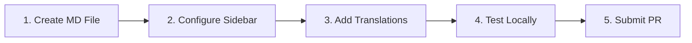
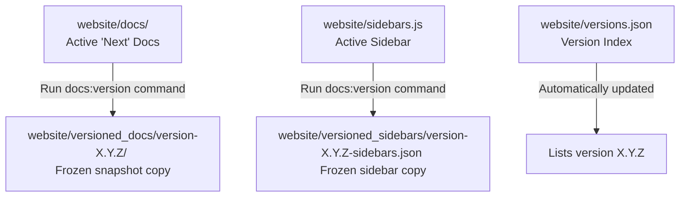

# Documentation Governance & Guide

This master guide consolidates all information regarding the project's documentation lifecycle. It includes high-level governance policies, ownership models, and a step-by-step developer guide for adding new content, managing native versioning, and translating pages.

---

## Part 1: Governance & Ownership

Our documentation is the primary source of truth for users, contributors, and maintainers. To ensure quality, consistency, and accuracy, we adhere to the following principles.

### Rules of Thumb
* **User Docs**: Update user-facing manuals immediately when any user-visible behavior, UI element, or setup step changes.
* **Technical Docs**: Update technical and architectural documentation when code structure, API design, dependency structures, or release pipelines are modified.
* **Contributor Docs**: Update contributor guidelines when workflow expectations, pull request checklists, or style guides change.
* **Homepage**: Keep the main homepage focused on the product narrative and high-level onboarding, not deep implementation details.

### Ownership Model
We use a lightweight, distributed ownership model:
* **Information Architect**: One maintainer acts as the custodian of the overall structure, homepage consistency, and navigation menus.
* **Feature Authors**: Developers who implement a feature or change are responsible for writing and updating the corresponding documentation pages.
* **Reviewers**: Pull request reviewers must ensure that documentation updates are included in the PR if the code changes warrant them.

---

## Part 2: Step-by-Step Guide to Adding Documentation

Adding new documentation to the website is a 5-step process:



### Step 1: Create the Markdown File
Create a new `.md` (or `.mdx`) file under the appropriate subdirectory of `website/docs/`:
* `website/docs/user/`: For user guides, installation manuals, and user-facing troubleshooting.
* `website/docs/technical/`: For architecture design, codebase organization, database schemas, and release steps.
* `website/docs/contributing/`: For developer workflows, guidelines, and governance documents.

Add the required frontmatter at the top of the file:
```markdown
---
title: My New Guide Title
sidebar_label: My Guide
description: A short description of the page content for search engines and SEO.
---
```

### Step 2: Configure the Sidebar Navigation
The sidebar navigation layout is defined in `website/sidebars.js`.

1. Open `website/sidebars.js`.
2. Locate the appropriate category (e.g., `Functional`, `Technical`, or `Contributor`).
3. Add the relative path of your file (excluding the `website/docs/` prefix and `.md` extension) to the `items` array:

```javascript
    {
      type: "category",
      label: "Contributor",
      items: [
        "contributing/getting-started",
        "contributing/pull-request-guidelines",
        "contributing/documentation-governance" // Added here
      ]
    }
```

:::warning
If you are adding documentation to an archived release version (like version `1.2.9`), do **not** edit files in `website/docs/` or `website/sidebars.js`. Instead, see [Part 3: Document Versioning](#part-3-document-versioning) below.
:::

---

## Part 3: Document Versioning

This project uses Docusaurus native documentation versioning to archive historical states of the documentation corresponding to specific software releases.

* **Next (Active Development)**: Refers to files currently inside `website/docs/` and configured in `website/sidebars.js`.
* **Archived Versions (e.g., 1.2.9)**: Frozen snapshots stored under `website/versioned_docs/version-1.2.9/` and sidebar config `website/versioned_sidebars/version-1.2.9-sidebars.json`.

### Lifecycle Diagram



### Modifying Versioned Docs (Version 1.2.9)
To add or modify documentation specifically for version `1.2.9`:
1. **Add/Edit the File**: Create or modify the file under `website/versioned_docs/version-1.2.9/contributing/` (or other subdirectories).
2. **Update the Versioned Sidebar**: Edit the JSON configuration in `website/versioned_sidebars/version-1.2.9-sidebars.json` to register the file ID.

### Cutting a New Version
When preparing a new major/minor software release (e.g., `1.3.0`), freeze the current state of documentation:
1. Navigate to the `website` directory:
   ```bash
   cd website
   ```
2. Run the versioning command:
   ```bash
   npx docusaurus docs:version 1.3.0
   ```

---

## Part 4: Translation and Localization (i18n)

The website currently supports English (`en`, source) and Dutch (`nl`, translation). All translation assets are stored in the `website/i18n/nl/` folder.

### Translating Markdown content
To translate documentation or static pages, copy the source file to the corresponding localization directory and translate its contents:

| Source File Location | Destination Translation Location |
|---|---|
| `website/docs/contributing/guide.md` (Next Docs) | `website/i18n/nl/docusaurus-plugin-content-docs/current/contributing/guide.md` |
| `website/versioned_docs/version-1.2.9/contributing/guide.md` | `website/i18n/nl/docusaurus-plugin-content-docs/version-1.2.9/contributing/guide.md` |
| `website/src/pages/index.js` (Static React page) | `website/i18n/nl/docusaurus-plugin-content-pages/index.js` |

### Translating UI & Sidebar Labels (JSON)
1. **Extract new strings**: If you have changed sidebar labels or UI code, extract them to JSON files:
   ```bash
   npm run write-translations -- --locale nl
   ```
2. **Translate JSON entries**: Open and update the `"message"` value in:
   * `website/i18n/nl/code.json` (theme elements, header/footer navigation items)
   * `website/i18n/nl/docusaurus-plugin-content-docs/current.json` (Next sidebar categories)
   * `website/i18n/nl/docusaurus-plugin-content-docs/version-1.2.9.json` (Version 1.2.9 sidebar categories)

---

## Part 5: Local Development & Validation

Before pushing any documentation modifications to production:

### 1. Install Dependencies
Run this in the `website/` directory to set up Docusaurus:
```bash
npm install
```

### 2. Start the Local Development Server
* **Preview English**: `npm run start` (available at `http://localhost:3000/timemanagement/`)
* **Preview Dutch**: `npm run start -- --locale nl` (available at `http://localhost:3000/timemanagement/nl/`)

### 3. Run a Production Build Verification
To ensure there are no syntax errors, configuration issues, or broken links:
```bash
npm run build
```
This command must run successfully without errors before a Pull Request is merged.
