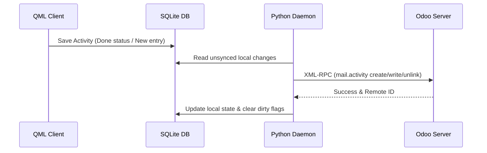

# Activities Module Technical Reference

The Activities Module implements localized activity planning, Odoo activity synchronization, and follow-up creation.

## Codebase Map

| Layer | Path | Purpose |
|---|---|---|
| **Frontend UI** | `qml/features/activities/` | UI pages and components for activities |
| **State & Logic** | `models/activity.js` | JS database bindings and UI state management |
| **Backend Service** | `src/daemon.py` | Python activity manager and sync worker |
| **D-Bus Interface** | `src/backend.py` | D-Bus methods exposing activity status |

## Database Schema

Activities are stored locally in the following SQLite tables:

### `mail_activity_app`
Stores activity instances synced with Odoo or created locally.
* `id` (INTEGER, Primary Key): Local unique ID.
* `res_id` (INTEGER): ID of the linked document (e.g. Project or Task ID).
* `res_model` (TEXT): Name of the linked model (e.g. `project.project` or `project.task`).
* `activity_type_id` (INTEGER): References the activity type.
* `summary` (TEXT): Single-line overview.
* `note` (TEXT): Rich/Plain multiline text.
* `date_deadline` (TEXT): Due date in YYYY-MM-DD.
* `user_id` (INTEGER): Assignee reference.
* `done` (INTEGER): Binary status (0 = Open, 1 = Completed).

### `mail_activity_type_app`
Stores types of activities (e.g., Email, Call, Meeting, To-Do).
* `id` (INTEGER, Primary Key): Unique Odoo activity type ID.
* `name` (TEXT): Type label.
* `icon` (TEXT): Icon identifier corresponding to Lomiri style.

---

## Sync Mechanism & Network Protocol

### Odoo XML-RPC Model Mapping
* **Remote Model**: `mail.activity`
* **Sync Direction**: Bidirectional (local modifications -> server; server modifications -> local).

---

## D-Bus Call Interface

The frontend communicates with the background service daemon using the following D-Bus methods declared in `src/backend.py`:

* `CreateActivity(activity_data_json)`: Invoked to spawn a new activity.
* `CompleteActivity(activity_id)`: Marks an activity as done locally and queues it for the sync process.
* `DeleteActivity(activity_id)`: Deletes an activity locally and queues removal on Odoo.
