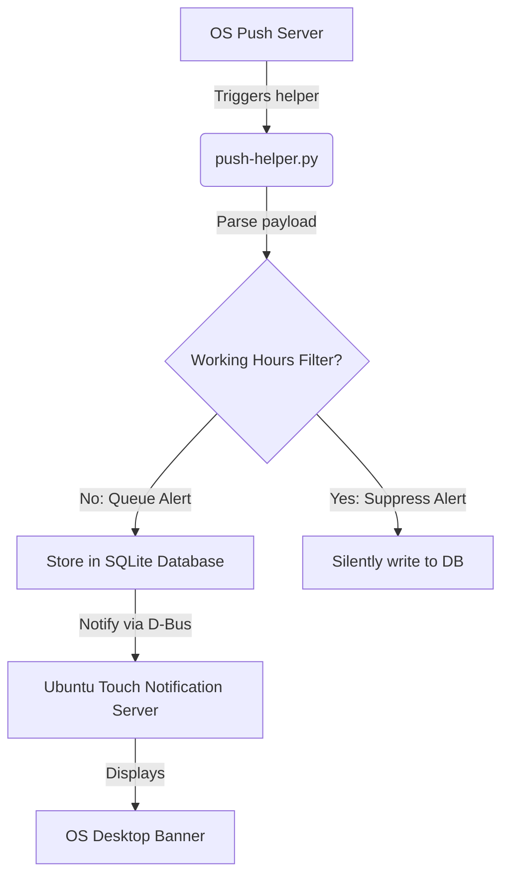

# Notifications Module Technical Reference

This page describes local database notification structures, the Ubuntu Touch Notification Server integration, background notification helper scripts, and scheduling logic.

## Codebase Map

| Layer | Path | Purpose |
|---|---|---|
| **Push Helper** | `push-helper.py` | Standalone script triggered by OS push service |
| **Notification UI** | `qml-notify-module/` | QML notify alerts and dropdown banner components |
| **Local Store** | `models/notifications.js` | JS bindings to query and update local notification states |
| **Daemon Logic** | `src/daemon.py` | Local alarm scheduler and smart working-hours filters |

## SQLite Table: `notification`

Notifications are managed locally using the following SQLite schema:

* `id` (INTEGER, Primary Key): Unique database identifier.
* `title` (TEXT): Headline label of the notification.
* `message` (TEXT): Full body message.
* `notif_type` (TEXT): Category (`ACTIVITY`, `TASK_ASSIGN`, `SYNC_CONFLICT`).
* `timestamp` (TEXT): Received timestamp (ISO 8601).
* `read_status` (INTEGER): Status indicator (0 = Unread, 1 = Read).
* `payload` (TEXT): JSON dump of additional action fields.

---

## Push Notification Mechanism

The TimeManagement application integrates with the Ubuntu Touch push notifications system using the `push-helper.py` script.

### Incoming Push Architecture

### Working Hours Filter
To prevent user fatigue, the `push-helper.py` evaluates system configurations before alerting:
* Checks the current system local time against `start_hour` and `end_hour` values in `app_settings`.
* If a push is received outside these hours, the alert is logged silently in the SQLite database (`notification` table) with `read_status = 0`, but the system desktop banner is bypassed.
