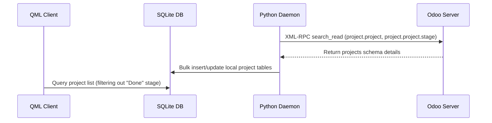

# Projects Module Technical Reference

The Projects Module manages high-level project metadata, sub-project hierarchies, stage-based mapping, and Favorite status.

## Codebase Map

| Layer | Path | Purpose |
|---|---|---|
| **Frontend UI** | `qml/features/projects/` | Views and detailed components for projects |
| **State & Logic** | `models/project.js` | JS helper modules, stage queries, and favorite state |
| **Backend Service** | `src/sync_from_odoo.py` | Sync worker pulling projects and stages |
| **D-Bus Interface** | `src/backend.py` | D-Bus methods exposing project listings |

## Database Schema

Projects and stages are stored locally in the following SQLite tables:

### `project_project_app`
* `id` (INTEGER, Primary Key): Unique Project ID (Odoo remote ID).
* `name` (TEXT): Project title.
* `parent_id` (INTEGER): References parent project (self-relation for sub-projects).
* `date_start` (TEXT): Project start date.
* `date` (TEXT): Project end date / deadline.
* `description` (TEXT): Detailed description of project scope.
* `user_id` (INTEGER): Assigned owner/manager.
* `allocated_hours` (REAL): Budgeted hour allocation.
* `color` (INTEGER): Accent color index.
* `favorite` (INTEGER): Favorite status flag (0 = No, 1 = Yes).
* `stage_id` (INTEGER): References the current project stage.

### `project_project_stage_app`
* `id` (INTEGER, Primary Key): Stage ID.
* `name` (TEXT): Stage name (e.g. In Progress, Cancelled, On Hold, Done).
* `sequence` (INTEGER): Ordering sequence.

---

## Sync Mechanism & Network Protocol

### Odoo XML-RPC Model Mapping
* **Remote Model**: `project.project` (Project entity), `project.project.stage` (Stages)
* **Sync Direction**: Pull-oriented (read-only mapping for structure, local favorites toggling).

---

## D-Bus Call Interface

* `GetProjects()`: Returns a JSON array of all active projects.
* `ToggleProjectFavorite(project_id, state)`: Marks a project as favorite locally.
