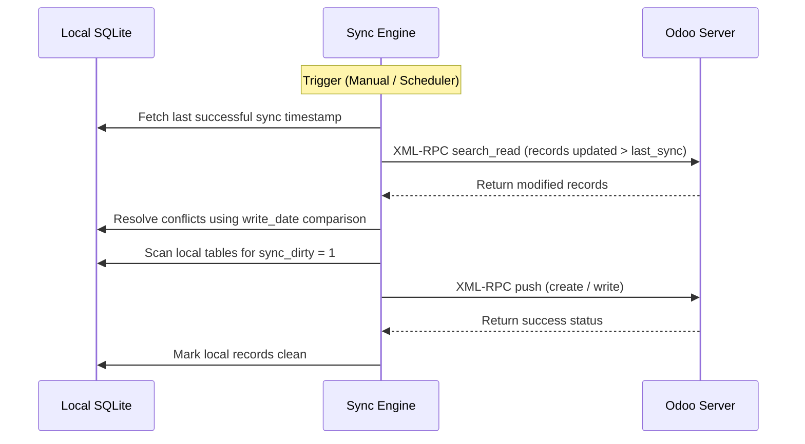

# Sync & Accounts Technical Reference

This module oversees multi-instance Odoo configuration, manual and scheduler-driven background synchronization, success/failure status messaging, and schema integrity constraints.

## Codebase Map

| Layer | Path | Purpose |
|---|---|---|
| **Frontend UI** | `qml/features/settings/` | Account configuration, sync status status indicators, and logs |
| **State & Logic** | `models/accounts.js` | Account creation, verification, and credentials checking |
| **Sync Manager** | `src/daemon.py` | Main event loops scheduling synchronization |
| **Pull Sync Engine** | `src/sync_from_odoo.py` | Sync worker querying Odoo XML-RPC endpoints |
| **Push Sync Engine** | `src/sync_to_odoo.py` | Sync worker pushing dirty records back |
| **Network Client** | `src/odoo_client.py` | XML-RPC client connection wrapper |

## Database Schema

Local account configurations and synchronization logs are stored in:

### `users`
* `id` (INTEGER, Primary Key): Local user account sequence.
* `name` (TEXT): Unique instance name identifier.
* `url` (TEXT): Server URL.
* `db` (TEXT): Odoo database identifier.
* `username` (TEXT): Username / Email.
* `password` (TEXT): Encrypted user token / password.

### `sync_report`
* `id` (INTEGER, Primary Key): Log identifier.
* `sync_time` (TEXT): Timestamp of the synchronization execution.
* `status` (TEXT): Status message (`SUCCESS`, `FAILED`).
* `details` (TEXT): Exception trace or syncing summary details.

---

## Detailed Sync Mechanism

The synchronization engine implements a robust timeline-aware conflict resolution pattern.

### Conflict Resolution Strategy
* If a record was modified both locally and on the server since the last sync, timestamps (`write_date` from Odoo vs local `update_time`) are evaluated.
* The newer timestamp wins by default. If timestamps are identical or ambiguous, the user is prompted with a conflict resolution dialog to choose which version to retain.

---

## D-Bus Call Interface

* `TriggerSync()`: Manually fires the background sync worker.
* `GetSyncStatus()`: Returns JSON containing the last execution timestamp, state, and logs.
* `VerifyConnection(url, username, password)`: Queries Odoo via XML-RPC to validate DB parameters before registration.
