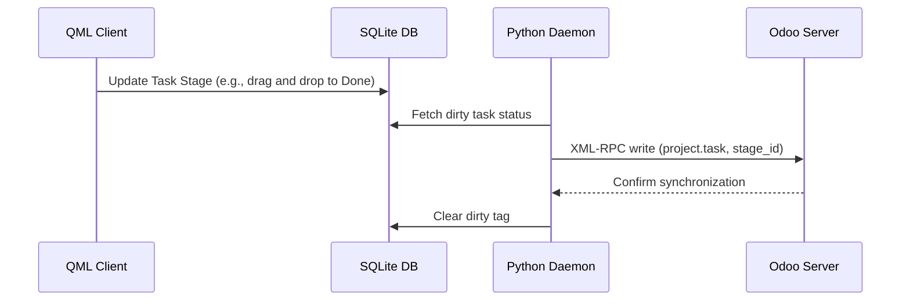

# Tasks Module Technical Reference

The Tasks Module manages work tasks, parent-child task relations, stage/Kanban state alignment, assignees, deadlines, and scheduling.

## Codebase Map

| Layer | Path | Purpose |
|---|---|---|
| **Frontend UI** | `qml/features/tasks/` | Task lists, details, editing, and kanban views |
| **State & Logic** | `models/task.js` | JS task model, stage transition logic, and filters |
| **Backend Service** | `src/sync_to_odoo.py` | Sync worker pushing task updates and scheduling changes |
| **D-Bus Interface** | `src/backend.py` | D-Bus methods for task mutations and retrieval |

## Database Schema

Tasks and assignees are stored locally in the following SQLite tables:

### `project_task_app`
* `id` (INTEGER, Primary Key): Unique Task ID.
* `name` (TEXT): Task name.
* `project_id` (INTEGER): References parent project.
* `parent_id` (INTEGER): References parent task (for nested sub-tasks).
* `date_deadline` (TEXT): Task deadline date (YYYY-MM-DD).
* `description` (TEXT): Detailed task descriptions (supports HTML).
* `stage_id` (INTEGER): References `project_task_type_app`.
* `favorite` (INTEGER): Favorite status indicator.
* `planned_hours` (REAL): Estimated hours.
* `user_ids` (TEXT): JSON array of assignee user IDs.

### `project_task_assignee_app`
Maps task assignees to res_users.
* `task_id` (INTEGER): References task.
* `user_id` (INTEGER): References instance user.

### `project_task_type_app`
Stores task stages (Kanban stages).
* `id` (INTEGER, Primary Key): Task stage ID.
* `name` (TEXT): Stage name (e.g. To Do, In Progress, Done).

---

## Sync Mechanism & Network Protocol

### Odoo XML-RPC Model Mapping
* **Remote Model**: `project.task` (Task entity), `project.task.type` (Task stages)
* **Sync Direction**: Bidirectional.

---

## D-Bus Call Interface

* `GetTasks()`: Returns JSON containing all tasks.
* `UpdateTaskStage(task_id, stage_id)`: Transitions a task to a different Kanban stage.
* `CreateTask(task_data_json)`: Instantiates a new task locally and queues sync.
* `RescheduleTask(task_id, new_deadline)`: Updates deadline dates.
