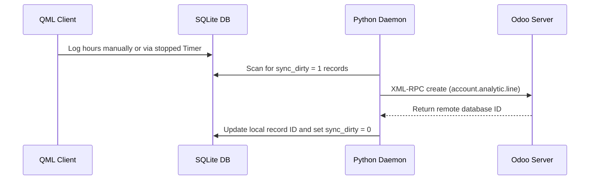

# Timesheets Module Technical Reference

The Timesheets Module governs work hour registration, running task timers, background timer persistence, and Odoo timesheet entry syncing.

## Codebase Map

| Layer | Path | Purpose |
|---|---|---|
| **Frontend UI** | `qml/features/timesheets/` | Logs list, manual entry forms, and timer overlays |
| **State & Logic** | `models/timesheet.js` | JS timesheet database bindings and manual logging logic |
| **Timer Service** | `models/timer_service.js` | JS timer worker coordinating state, notifications, and ticks |
| **Backend Service** | `src/sync_to_odoo.py` | Sync worker pushing timesheet entries |
| **D-Bus Interface** | `src/backend.py` | D-Bus methods exposing timesheet logging and active timer state |

## Database Schema

Timesheet entries are stored locally in the following SQLite table:

### `account_analytic_line_app`
* `id` (INTEGER, Primary Key): Unique analytic line ID.
* `name` (TEXT): Description/Notes logged by the user.
* `date` (TEXT): Date of work registration (YYYY-MM-DD).
* `unit_amount` (REAL): Hours spent (represented as decimal, e.g. 1.5 hours = 1h 30m).
* `project_id` (INTEGER): References the parent project.
* `task_id` (INTEGER): References the parent task.
* `user_id` (INTEGER): References the user entering the timesheet.
* `eisenhower_priority` (TEXT): Priority scale (Urgent/Important matrix).
* `sync_dirty` (INTEGER): Flag for pending remote synchronization (0 = Clean, 1 = Dirty).

---

## Sync Mechanism & Network Protocol

### Odoo XML-RPC Model Mapping
* **Remote Model**: `account.analytic.line` (Odoo Timesheets)
* **Sync Direction**: Bidirectional.

---

## Timer Service & Persistence

The active timer state is governed by `models/timer_service.js` and persists across app closures.
* When a timer starts, the timestamp `start_time` is written to local storage.
* Even if the UI crashes or closes, the Python daemon checks the running timer state on boot and calculates elapsed time using system clock diffs.

---

## D-Bus Call Interface

* `LogTime(timesheet_data_json)`: Pushes a new timesheet record.
* `GetActiveTimer()`: Retrieves details of the running timer if active.
* `StopActiveTimer()`: Stops the timer and formats the elapsed time into a new timesheet entry.
