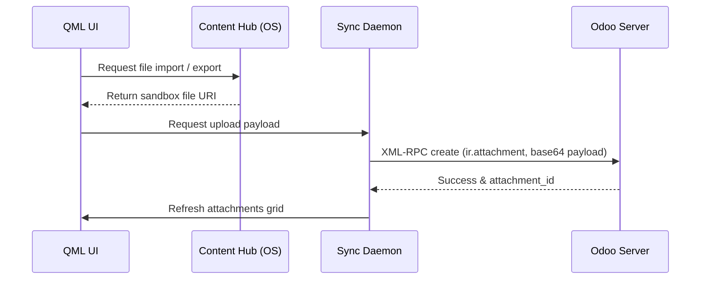

# UI/UX & Navigation Technical Reference

This page describes the user interface framework, navigation routing patterns, dark/light theme switching, and the Content Hub attachment management system.

## Codebase Map

| Layer | Path | Purpose |
|---|---|---|
| **Root Shell** | `qml/TSApp.qml` | Application entry point and layout shell |
| **Hamburger Menu**| `qml/components/NavigationMenu.qml` | Desktop/mobile navigation drawer |
| **Shared Layouts** | `qml/components/` | Custom grids, text widgets, and icons |
| **Attachment UI** | `qml/features/updates/Attachments.qml` | Attachments grid and browser screens |
| **Helper Utils** | `models/utils.js` | UI formats and theme helpers |

## Interface Design and Navigation Layout

The application utilizes QML (Qt Quick Controls 2 - Suru Theme layout) optimized for convergent platforms:

### 1. Multi-Pane Responsive Design (Convergence)
* **Mobile Mode**: Single active page. Left edge swipes trigger a drawer menu.
* **Desktop/Tablet Mode**: Employs a split-pane layout. Navigation menu is pinned permanently to the left side while sub-menus and detail screens open in side-by-side viewports.

### 2. Navigation Routing
Navigation handles sequential hierarchy (e.g. Projects -> Tasks -> Timesheets) using a central stack model:
```qml
StackView {
    id: pageStack
    anchors.fill: parent
    initialItem: Qt.resolvedUrl("features/dashboard/Dashboard.qml")
}
```

---

## Content Hub Attachment System

Ubuntu Touch uses the **Content Hub** portal mechanism to share files across application boundaries securely. 

### Local Schema Mappings

#### `ir_attachment_app`
Caches attachment metadata.
* `id` (INTEGER, Primary Key): Odoo attachment ID.
* `name` (TEXT): File name.
* `datas` (TEXT): Base64 encoded file data (if stored locally).
* `res_model` (TEXT): Linked model name (e.g., `project.task`).
* `res_id` (INTEGER): Linked record ID.

#### `attachment_download_app`
Tracks download status of large attachments.
* `attachment_id` (INTEGER): References the attachment record.
* `local_path` (TEXT): Absolute path to file on disk.
* `status` (TEXT): State (`NOT_DOWNLOADED`, `DOWNLOADING`, `DOWNLOADED`).

### Attachment Synchronization Flow


