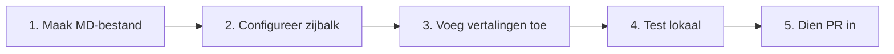
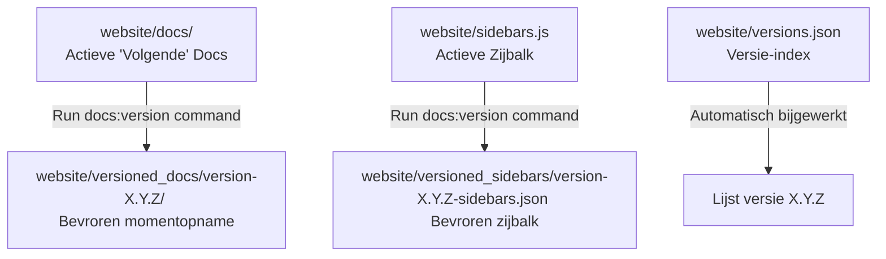

# Documentatiebeleid & Gids

Deze mastergids consolideert alle informatie over de levenscyclus van de projectdocumentatie. Het bevat beleidslijnen op hoog niveau, eigendomsmodellen en een stappenplan voor ontwikkelaars voor het toevoegen van nieuwe inhoud, het beheren van native versionering en het vertalen van pagina's.

---

## Deel 1: Beleid & Eigendom

Onze documentatie is de primaire bron van waarheid voor gebruikers, bijdragers en onderhouders. Om kwaliteit, consistentie en nauwkeurigheid te garanderen, houden we ons aan de volgende principes.

### Vuistregels
* **Gebruikersdocumentatie**: Werk gebruikershandleidingen onmiddellijk bij wanneer er iets verandert in het gedrag dat zichtbaar is voor gebruikers, UI-elementen of installatiestappen.
* **Technische documentatie**: Werk technische en architecturale documentatie bij wanneer de codestructuur, het API-ontwerp, de afhankelijkheidsstructuren of de release-pipelines worden gewijzigd.
* **Bijdragersdocumentatie**: Werk de richtlijnen voor bijdragers bij wanneer de verwachtingen voor de workflow, pull-request-checklists of stijlgidsen veranderen.
* **Homepage**: Houd de hoofdpagina gefocust op het productverhaal en onboarding op hoog niveau, niet op diepgaande implementatiedetails.

### Eigendomsmodel
We gebruiken een lichtgewicht, gedistribueerd eigendomsmodel:
* **Informatiearchitect**: Eén onderhouder treedt op als beheerder van de algehele structuur, consistentie van de homepage en navigatiemenu's.
* **Feature-auteurs**: Ontwikkelaars die een functie of wijziging implementeren, zijn verantwoordelijk voor het schrijven en bijwerken van de bijbehorende documentatiepagina's.
* **Reviewers**: Pull-request-reviewers moeten ervoor zorgen dat documentatie-updates in de PR zijn opgenomen als de codewijzigingen dit rechtvaardigen.

---

## Deel 2: Stappenplan voor het toevoegen van documentatie

Het toevoegen van nieuwe documentatie aan de website is een proces van 5 stappen:



### Stap 1: Maak het Markdown-bestand
Maak een nieuw `.md` (of `.mdx`) bestand onder de juiste submap van `website/docs/`:
* `website/docs/user/`: Voor gebruikershandleidingen, installatiehandleidingen en probleemoplossing voor gebruikers.
* `website/docs/technical/`: Voor architectuurontwerp, organisatie van de codebase, databaseschema's en releasestappen.
* `website/docs/contributing/`: Voor ontwikkelaarsworkflows, richtlijnen en beleidsdocumenten.

Voeg de vereiste frontmatter toe aan de bovenkant van het bestand:
```markdown
---
title: Titel van mijn nieuwe gids
sidebar_label: Mijn Gids
description: Een korte beschrijving van de pagina-inhoud voor zoekmachines en SEO.
---
```

### Stap 2: Configureer de zijbalknavigatie
De navigatiestructuur van de zijbalk is gedefinieerd in `website/sidebars.js`.

1. Open `website/sidebars.js`.
2. Zoek de juiste categorie (bijv. `Functional`, `Technical` of `Contributor`).
3. Voeg het relatieve pad van uw bestand (exclusief het prefix `website/docs/` en de extensie `.md`) toe aan de `items`-array:

```javascript
    {
      type: "category",
      label: "Contributor",
      items: [
        "contributing/getting-started",
        "contributing/pull-request-guidelines",
        "contributing/documentation-governance" // Hier toegevoegd
      ]
    }
```

:::warning
Als u documentatie toevoegt aan een gearchiveerde releaseversie (zoals versie `1.2.9`), bewerk dan geen bestanden in `website/docs/` of `website/sidebars.js`. Zie in plaats daarvan [Deel 3: Documentversionering](#deel-3-documentversionering) hieronder.
:::

---

## Deel 3: Documentversionering

Dit project maakt gebruik van de ingebouwde documentversionering van Docusaurus om historische staten van de documentatie te archiveren die overeenkomen met specifieke softwarereleases.

* **Volgende (Actieve Ontwikkeling)**: Verwijst naar bestanden die zich momenteel in `website/docs/` bevinden en zijn geconfigureerd in `website/sidebars.js`.
* **Gearchiveerde versies (bijv. 1.2.9)**: Bevroren momentopnamen opgeslagen onder `website/versioned_docs/version-1.2.9/` en zijbalkconfiguratie `website/versioned_sidebars/version-1.2.9-sidebars.json`.

### Levenscyclusdiagram



### Geversioneerde documenten bewerken (Versie 1.2.9)
Om documentatie specifiek voor versie `1.2.9` toe te voegen of te wijzigen:
1. **Bestand toevoegen/bewerken**: Maak of wijzig het bestand onder `website/versioned_docs/version-1.2.9/contributing/` (of andere submappen).
2. **De geversioneerde zijbalk bijwerken**: Bewerk de JSON-configuratie in `website/versioned_sidebars/version-1.2.9-sidebars.json` om de bestands-ID te registreren.

### Een nieuwe versie maken
Wanneer u een nieuwe major/minor softwarerelease voorbereidt (bijv. `1.3.0`), bevriest u de huidige staat van de documentatie:
1. Navigeer naar de map `website`:
   ```bash
   cd website
   ```
2. Voer de opdracht voor versionering uit:
   ```bash
   npx docusaurus docs:version 1.3.0
   ```

---

## Deel 4: Vertaling en lokalisatie (i18n)

De website ondersteunt momenteel Engels (`en`, bron) en Nederlands (`nl`, vertaling). Alle vertaalactiva zijn opgeslagen in de map `website/i18n/nl/`.

### Markdown-inhoud vertalen
Om documentatie of statische pagina's te vertalen, kopieert u het bronbestand naar de overeenkomstige lokalisatiemap en vertaalt u de inhoud ervan:

| Locatie Bronbestand | Locatie Bestemming Vertaling |
|---|---|
| `website/docs/contributing/guide.md` (Volgende Docs) | `website/i18n/nl/docusaurus-plugin-content-docs/current/contributing/guide.md` |
| `website/versioned_docs/version-1.2.9/contributing/guide.md` | `website/i18n/nl/docusaurus-plugin-content-docs/version-1.2.9/contributing/guide.md` |
| `website/src/pages/index.js` (Statische React-pagina) | `website/i18n/nl/docusaurus-plugin-content-pages/index.js` |

### UI- en zijbalklabels vertalen (JSON)
1. **Nieuwe strings extraheren**: Als u zijbalklabels of UI-code hebt gewijzigd, extraheert u deze naar JSON-bestanden:
   ```bash
   npm run write-translations -- --locale nl
   ```
2. **JSON-vermeldingen vertalen**: Open en update de waarde `"message"` in:
   * `website/i18n/nl/code.json` (themamodules, navigatie-items voor kop-/voettekst)
   * `website/i18n/nl/docusaurus-plugin-content-docs/current.json` (volgende zijbalkcategorieën)
   * `website/i18n/nl/docusaurus-plugin-content-docs/version-1.2.9.json` (versie 1.2.9 zijbalkcategorieën)

---

## Deel 5: Lokale ontwikkeling en validatie

Voordat u documentatiewijzigingen naar productie pusht:

### 1. Afhankelijkheden installeren
Voer dit uit in de map `website/` om Docusaurus in te stellen:
```bash
npm install
```

### 2. Start de lokale ontwikkelserver
* **Preview Engels**: `npm run start` (beschikbaar op `http://localhost:3000/timemanagement/`)
* **Preview Nederlands**: `npm run start -- --locale nl` (beschikbaar op `http://localhost:3000/timemanagement/nl/`)

### 3. Voer een productiebuildverificatie uit
Om er zeker van te zijn dat er geen syntaxfouten, configuratieproblemen of gebroken links zijn:
```bash
npm run build
```
Deze opdracht moet met succes worden uitgevoerd zonder fouten voordat een Pull Request kan worden samengevoegd.
