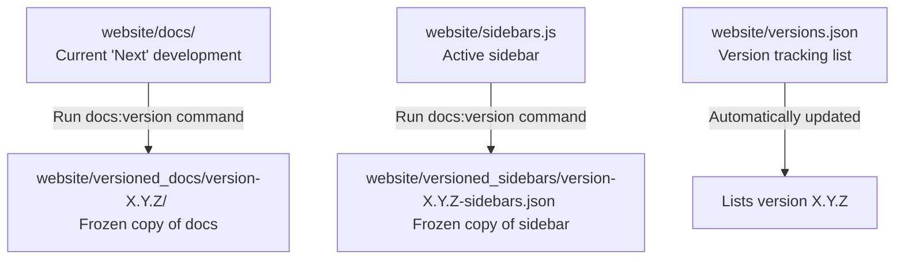

# Documentatie- en versiehandleiding

Deze handleiding is bedoeld voor bijdragers en beheerders. Het omvat hoe u documentatiepagina's toevoegt, de zijbalk configureert, de site lokaal verlicht en versiebeheer beheert.

---

## 1. Documentatie toevoegen en bewerken

Documentatiepagina's zijn geschreven in **Markdown** of **MDX** (Markdown met ondersteuning voor JSX/React-componenten).

### Bestandsstructuur

Alle documentatiebestanden bevinden zich in de kaart `website/docs/`:
- `website/docs/user/`: gebruik handleidingen, installatie-instructies en probleemoplossing.
- `website/docs/technical/`: Architectuur, moduleontwerpen, repositorydetails en bouw-/releaseprocessen.
- `website/docs/contributing/`: Richtlijnen, standaarden en workflowinstructies voor bijdragen.

### Een nieuwe pagina maken

1. Maak een nieuwe `.md` (of `.mdx`) bestand onder de juiste submap van `website/docs/`.
2. Voeg het bestand samen met de frontmatter toe:

```markdown
---
id: documentation-guide
title: Documentation and Versioning Guide
sidebar_label: Documentation & Versioning
description: Short summary of what this page covers for SEO and search tools.
---
```

### Inhoud schrijven

Docusaurus ondersteunt standaard Markdown, MDX en verschillende effectieve interactieve functies:

#### Waarschuwingen/toelichtingen
Gebruik waarschuwingen om belangrijke tips, waarschuwingen of opmerkingen te benadrukken:

```markdown
:::note
This is a standard informational note.
:::

:::tip
Use tips for helpful recommendations.
:::

:::warning
Warnings indicate potential pitfalls or actions that require caution.
:::
```

#### Zeemeermindiagrammen
Zeemeermindiagrammen worden volledig ondersteund in dit project. U kunt inline stroomdiagrammen of sequentiëlediagrammen schrijven:

```markdown
```mermaid
grafiek TD;
A[Markdown-bestand schrijven] --> B[sidebars.js opgesteld];
B --> C[Lokaal voorbeeld uitvoeren];
C --> D[Commit en PR];
```
```

---

## 2. De zijbalk uitgevoerd

De zijbalknavigatiestructuur wordt bedoeld in `website/sidebars.js`.

### Een pagina toevoegen aan de zijbalk

1. Open `website/sidebars.js`.
2. Zoek de categorie waarin het nieuwe document zal laten verschijnen.
3. Voeg het relatieve pad van uw document (exclusief het voorvoegsel `website/docs/` en de extensie `.md`/`.mdx`) toe aan de itemsarray.

Om bijvoorbeeld `website/docs/contributing/documentation-guide.md` toe te voegen:

```javascript
    {
      type: "category",
      label: "Contributor",
      items: [
        "contributing/getting-started",
        "contributing/pull-request-guidelines",
        "contributing/documentation-governance",
        "contributing/documentation-guide" // Added here
      ]
    }
```

---

## 3. Documentatieversiebeheer van Docusaurus

Dit project maakt gebruik van Docusaurus eigen documentatieversiebeheer om periodieke releases van de documentatie te archiveren.

- **Volgende (niet-uitgebrachte)** versie: komt gelijk met bestanden in de actieve ontwikkelingstak. Bronbestanden worden rechtstreeks in `website/docs/` bewerkt.
- **Gearchiveerde (vrijgegeven)** versies: historische versies van documentatie. Ze zijn bevroren en alleen-lezen, tenzij specifiek gepatcht.

### De versiebeheerlevenscyclus



### Een nieuwe versie snijden

Wanneer u een nieuwe versie van de software uitbrengt (bijvoorbeeld versie `1.3.0`), bevriest u de huidige status van de documentatie:

1. Navigeren naar de kaart `website`:
   ```bash
   cd website
   ```
2. Voer het versiecommando uit met behulp van de Docusaurus CLI via `npx`:
   ```bash
   npx docusaurus docs:version 1.3.0
   ```

### Wat gebeurt er achter de schermen?

Door de versiecommando uit te voeren, worden de volgende structuren gemaakt:
- `website/versions.json`: De versietag `1.3.0` wordt aan de array toegevoegd.
- `website/versioned_docs/version-1.3.0/`: Hier wordt een kopie van alle bestanden van `website/docs/` opgeslagen.
- `website/versioned_sidebars/version-1.3.0-sidebars.json`: hier wordt een momentopname van `website/sidebars.js` opgeslagen.

### Documenten met versies aanpassen

- **De verwijderbare release verwijderen (volgende)**: bewerk bestanden in `website/docs/`.
- **Een uitgebrachte versie bijwerken (bijvoorbeeld 1.2.9)**: Bewerk het vaste bestand in `website/versioned_docs/version-1.2.9/`.

---

## 4. Lokale ontwikkeling en validering

Voer de site altijd lokaal uit om een ​​voorbeeld van uw documentatiewijzigingen te bekijken voordat u een Pull Request indient.

### Voorbeeld instellen en starten

Voer deze opdrachten uit in de kaart `website/`:

1. **Installateur afhankelijkheden**:
   ```bash
   npm install
   ```
2. **Start lokale ontwikkelingsserver**:
   ```bash
   npm run start
   ```
De site wordt automatisch geladen op `http://localhost:3000/`.

### Verifiëren en bouwen

Voordat u een commit maakt, voert u een productiebuild uit om te controleren op verbroken koppelingen en configuratiefouten:

```bash
npm run build
```
Eventuele verbroken interne links of eerdere configuraties zorgen ervoor dat de build mislukt, waardoor implementatieproblemen worden voorkomen.
