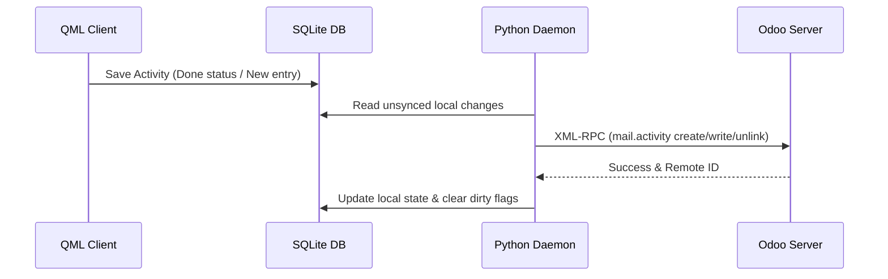

# Activiteiten Module Technische Referentie

De Activiteitenmodule implementeert gelokaliseerde activiteitenplanning, Odoo-activiteitensynchronisatie en het creëren van vervolgacties.

## Codebase-kaart

| Laag | Pad | Doel |
|---|---|---|
| **Frontend-UI** | `qml/features/activities/` | UI-pagina's en componenten voor activiteiten |
| **State & Logica** | `models/activity.js` | JS-databasebindingen en UI-statusbeheer |
| **Backend-service** | `src/daemon.py` | Python-activiteitenmanager en synchronisatiewerker |
| **D-Bus-interface** | `src/backend.py` | D-Bus-methoden die de activiteitsstatus blootleggen |

## Databaseschema

Activiteiten worden lokaal opgeslagen in de volgende SQLite-tabellen:

### `mail_activity_app`
Slaat activiteitsinstanties op die zijn gesynchroniseerd met Odoo of lokaal zijn gemaakt.
* `id` (INTEGER, primaire sleutel): lokale unieke ID.
* `res_id` (INTEGER): ID van het gekoppelde document (bijvoorbeeld project- of taak-ID).
* `res_model` (TEXT): Naam van het gekoppelde model (bijvoorbeeld `project.project` of `project.task`).
* `activity_type_id` (INTEGER): verwijst naar het activiteitstype.
* `summary` (TEKST): Overzicht van één regel.
* `note` (TEKST): rijke/gewone tekst met meerdere regels.
* `date_deadline` (TEKST): Vervaldatum in JJJJ-MM-DD.
* `user_id` (INTEGER): referentie van de toegewezen persoon.
* `done` (INTEGER): Binaire status (0 = Open, 1 = Voltooid).

### `mail_activity_type_app`
Slaat typen activiteiten op (bijvoorbeeld e-mail, bellen, vergadering, takenlijst).
* `id` (INTEGER, Primaire sleutel): Unieke Odoo-activiteitstype-ID.
* `name` (TEKST): Typelabel.
* `icon` (TEXT): Pictogram-ID die overeenkomt met de Lomiri-stijl.

---

## Synchronisatiemechanisme en netwerkprotocol

### Odoo XML-RPC-modeltoewijzing
* **Extern model**: `mail.activity`
* **Synchronisatierichting**: Bidirectioneel (lokale wijzigingen -> server; serveraanpassingen -> lokaal).

---

## D-Bus-oproepinterface

De frontend communiceert met de achtergrondservice-daemon met behulp van de volgende D-Bus-methoden die zijn gedeclareerd in `src/backend.py`:

* `CreateActivity(activity_data_json)`: aangeroepen om een ​​nieuwe activiteit voort te brengen.
* `CompleteActivity(activity_id)`: Markeert een activiteit als lokaal uitgevoerd en zet deze in de wachtrij voor het synchronisatieproces.
* `DeleteActivity(activity_id)`: Verwijdert een activiteit lokaal en wacht op verwijdering in Odoo.
