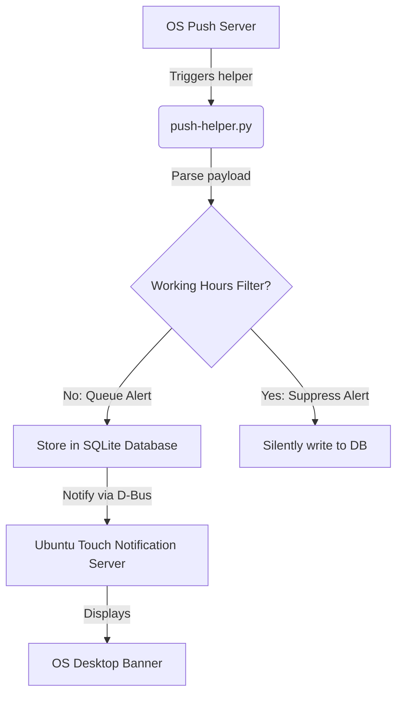

# Notificaties Module Technische Referentie

Deze pagina beschrijft de structuren voor lokale databasemeldingen, de Ubuntu Touch Notification Server-integratie, helperscripts voor achtergrondmeldingen en planningslogica.

## Codebase-kaart

| Laag | Pad | Doel |
|---|---|---|
| **Duwhulp** | `push-helper.py` | Zelfstandig script geactiveerd door OS-pushservice |
| **Meldingsgebruikersinterface** | `qml-notify-module/` | QML-waarschuwingen en dropdown-bannercomponenten |
| **Lokale winkel** | `models/notifications.js` | JS-bindingen om lokale meldingsstatussen op te vragen en bij te werken |
| **Daemon-logica** | `src/daemon.py` | Lokale alarmplanner en slimme werktijdenfilters |

## SQLite-tabel: `notification`

Meldingen worden lokaal beheerd met behulp van het volgende SQLite-schema:

* `id` (INTEGER, primaire sleutel): unieke database-ID.
* `title` (TEXT): Koplabel van de melding.
* `message` (TEKST): Volledig bericht.
* `notif_type` (TEKST): Categorie (`ACTIVITY`, `TASK_ASSIGN`, `SYNC_CONFLICT`).
* `timestamp` (TEKST): Tijdstempel ontvangen (ISO 8601).
* `read_status` (INTEGER): Statusindicator (0 = Ongelezen, 1 = Gelezen).
* `payload` (TEXT): JSON-dump van extra actievelden.

---

## Pushmeldingsmechanisme

De TimeManagement-applicatie kan worden geïntegreerd met het Ubuntu Touch-pushmeldingssysteem met behulp van het `push-helper.py`-script.

### Inkomende push-architectuur

### Werktijdenfilter
Om vermoeidheid bij de gebruiker te voorkomen, evalueert de `push-helper.py` de systeemconfiguraties voordat hij waarschuwt:
* Controleert de huidige lokale systeemtijd met de waarden `start_hour` en `end_hour` in `app_settings`.
* Als er buiten deze uren een push wordt ontvangen, wordt de waarschuwing stil in de SQLite-database (`notification` tabel) geregistreerd met `read_status = 0`, maar wordt de systeembureaubladbanner omzeild.
