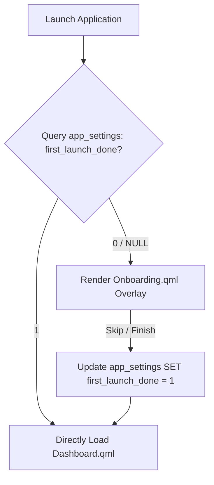

# Technische referentie voor onboarding

Op deze pagina wordt de onboarding-stroomvolgorde beschreven die wordt gepresenteerd tijdens de eerste uitvoering van de applicatie, inclusief persistentiestatusvlaggen en triggers voor snel overslaan.

## Codebase-kaart

| Laag | Pad | Doel |
|---|---|---|
| **Stroomcoördinator** | `qml/TSApp.qml` | Detecteert de onboardingstatus en geeft een overlay weer |
| **Onboarding-UI** | `qml/features/settings/Onboarding.qml` | Carrouselschuifregelaar, hulplijnen en initiële configuratievorm |
| **Statusopslag** | `models/database.js` | Verificatie van database-initialisatie-instelling |

## Onboarding-uitvoeringsstroom



## Instellingen Schemavlag

De onboardingstatus blijft bestaan ​​in `app_settings`:

```sql
SELECT value FROM app_settings WHERE key = 'first_launch_done';
```

* Als `value` niet `1` is, vergrendelt de applicatie de algemene navigatie en wordt de actieve viewport omgeleid naar de onboardingcarrousel.
* Als u de introductieschermen voltooit, wordt deze sleutel automatisch bijgewerkt naar `1`, zodat volgende lanceringen de reeks omzeilen.
* Gebruikers kunnen deze instelling handmatig resetten via de pagina Systeeminstellingen om de onboarding opnieuw te activeren.
