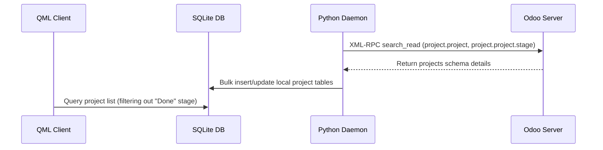

# Projecten Module Technische Referentie

De Projectenmodule beheert projectmetagegevens op hoog niveau, subprojecthiërarchieën, fasegebaseerde mapping en Favorietenstatus.

## Codebase-kaart

| Laag | Pad | Doel |
|---|---|---|
| **Frontend-UI** | `qml/features/projects/` | Aanzichten en gedetailleerde componenten voor projecten |
| **State & Logica** | `models/project.js` | JS-helpermodules, fasequery's en favoriete status |
| **Backend-service** | `src/sync_from_odoo.py` | Synchroniseer werker die projecten en fasen ophaalt |
| **D-Bus-interface** | `src/backend.py` | D-Bus-methoden die projectlijsten blootleggen |

## Databaseschema

Projecten en fasen worden lokaal opgeslagen in de volgende SQLite-tabellen:

### `project_project_app`
* `id` (INTEGER, primaire sleutel): unieke project-ID (Odoo externe ID).
* `name` (TEXT): Projecttitel.
* `parent_id` (INTEGER): Verwijzingen naar het bovenliggende project (zelfrelatie voor subprojecten).
* `date_start` (TEXT): Startdatum van het project.
* `date` (TEXT): Einddatum/deadline van het project.
* `description` (TEXT): Gedetailleerde beschrijving van de projectomvang.
* `user_id` (INTEGER): Toegewezen eigenaar/beheerder.
* `allocated_hours` (REAL): Gebudgetteerde urentoewijzing.
* `color` (INTEGER): Accentkleurindex.
* `favorite` (INTEGER): Favoriete statusvlag (0 = Nee, 1 = Ja).
* `stage_id` (INTEGER): Verwijst naar de huidige projectfase.

### `project_project_stage_app`
* `id` (INTEGER, primaire sleutel): Fase-ID.
* `name` (TEXT): Fasenaam (bijvoorbeeld In uitvoering, Geannuleerd, In de wacht, Klaar).
* `sequence` (INTEGER): Bestelvolgorde.

---

## Synchronisatiemechanisme en netwerkprotocol

### Odoo XML-RPC-modeltoewijzing
* **Extern model**: `project.project` (projectentiteit), `project.project.stage` (fasen)
* **Synchronisatierichting**: Pull-georiënteerd (alleen-lezen mapping voor structuur, schakelen tussen lokale favorieten).

---

## D-Bus-oproepinterface

* `GetProjects()`: Retourneert een JSON-array van alle actieve projecten.
* `ToggleProjectFavorite(project_id, state)`: Markeert een project lokaal als favoriet.
