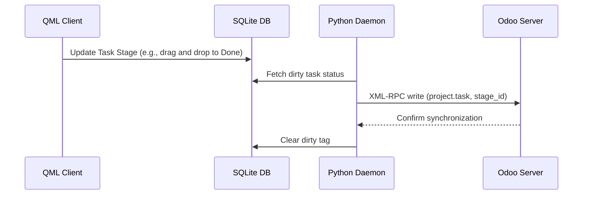

# Taken Module Technische Referentie

De Takenmodule beheert werktaken, taakrelaties tussen ouders en kinderen, afstemming van fase/Kanban-status, toegewezen personen, deadlines en planning.

## Codebase-kaart

| Laag | Pad | Doel |
|---|---|---|
| **Frontend-UI** | `qml/features/tasks/` | Takenlijsten, details, bewerken en kanban-weergaven |
| **State & Logica** | `models/task.js` | JS-taakmodel, faseovergangslogica en filters |
| **Backend-service** | `src/sync_to_odoo.py` | Synchronisatiewerker die taakupdates en planningswijzigingen pusht |
| **D-Bus-interface** | `src/backend.py` | D-Bus-methoden voor taakmutaties en ophalen |

## Databaseschema

Taken en toegewezen personen worden lokaal opgeslagen in de volgende SQLite-tabellen:

### `project_task_app`
* `id` (INTEGER, primaire sleutel): unieke taak-ID.
* `name` (TEXT): Taaknaam.
* `project_id` (INTEGER): verwijst naar het bovenliggende project.
* `parent_id` (INTEGER): Verwijst naar bovenliggende taak (voor geneste subtaken).
* `date_deadline` (TEXT): Deadlinedatum van de taak (JJJJ-MM-DD).
* `description` (TEXT): Gedetailleerde taakbeschrijvingen (ondersteunt HTML).
* `stage_id` (INTEGER): Referenties `project_task_type_app`.
* `favorite` (INTEGER): Favoriete statusindicator.
* `planned_hours` (ECHT): geschatte uren.
* `user_ids` (TEXT): JSON-array van toegewezen gebruikers-ID's.

### `project_task_assignee_app`
Wijst taaktoegewezen personen toe aan res_users.
* `task_id` (INTEGER): Referentietaak.
* `user_id` (INTEGER): Verwijzingeninstantiegebruiker.

### `project_task_type_app`
Slaat taakfasen (Kanban-fasen) op.
* `id` (INTEGER, primaire sleutel): Taakfase-ID.
* `name` (TEXT): Fasenaam (bijvoorbeeld To Do, In uitvoering, Klaar).

---

## Synchronisatiemechanisme en netwerkprotocol

### Odoo XML-RPC-modeltoewijzing
* **Extern model**: `project.task` (taakentiteit), `project.task.type` (taakfasen)
* **Synchronisatierichting**: Bidirectioneel.

---

## D-Bus-oproepinterface

* `GetTasks()`: Retourneert JSON met alle taken.
* `UpdateTaskStage(task_id, stage_id)`: zet een taak over naar een andere Kanban-fase.
* `CreateTask(task_data_json)`: Creëert lokaal een nieuwe taak en synchroniseert wachtrijen.
* `RescheduleTask(task_id, new_deadline)`: Updates van deadlinedata.
