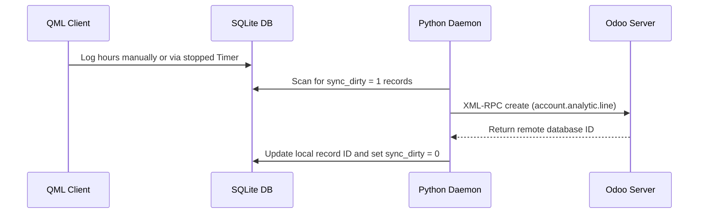

# Urenstaten Module Technische Referentie

De urenstatenmodule regelt de werkurenregistratie, het uitvoeren van taaktimers, de persistentie van de achtergrondtimer en de synchronisatie van Odoo-urenstateninvoer.

## Codebase-kaart

| Laag | Pad | Doel |
|---|---|---|
| **Frontend-UI** | `qml/features/timesheets/` | Loglijst, handmatige invoerformulieren en timer-overlays |
| **State & Logica** | `models/timesheet.js` | JS-urenregistratiedatabasebindingen en logica voor handmatige logboekregistratie |
| **Timerservice** | `models/timer_service.js` | JS-timerwerker die de status, meldingen en tikken coördineert |
| **Backend-service** | `src/sync_to_odoo.py` | Synchroniseer werknemer die urenstaatgegevens pusht |
| **D-Bus-interface** | `src/backend.py` | D-Bus-methoden die urenstaatregistratie en actieve timerstatus blootleggen |

## Databaseschema

Urenstaatgegevens worden lokaal opgeslagen in de volgende SQLite-tabel:

### `account_analytic_line_app`
* `id` (INTEGER, primaire sleutel): unieke analytische regel-ID.
* `name` (TEKST): Beschrijving/Notities vastgelegd door de gebruiker.
* `date` (TEXT): Datum van werkregistratie (JJJJ-MM-DD).
* `unit_amount` (REAL): bestede uren (weergegeven als decimaal, bijvoorbeeld 1,5 uur = 1u 30m).
* `project_id` (INTEGER): verwijst naar het bovenliggende project.
* `task_id` (INTEGER): verwijst naar de bovenliggende taak.
* `user_id` (INTEGER): Verwijst naar de gebruiker die de urenstaat invoert.
* `eisenhower_priority` (TEXT): Prioriteitsschaal (matrix Dringend/Belangrijk).
* `sync_dirty` (INTEGER): Vlag voor lopende externe synchronisatie (0 = Schoon, 1 = Vuil).

---

## Synchronisatiemechanisme en netwerkprotocol

### Odoo XML-RPC-modeltoewijzing
* **Model op afstand**: `account.analytic.line` (Odoo-urenstaten)
* **Synchronisatierichting**: Bidirectioneel.

---

## Timerservice en doorzettingsvermogen

De actieve timerstatus wordt bepaald door `models/timer_service.js` en blijft bestaan ​​na het sluiten van apps.
* Wanneer een timer start, wordt de tijdstempel `start_time` naar de lokale opslag geschreven.
* Zelfs als de gebruikersinterface crasht of sluit, controleert de Python-daemon de lopende timerstatus bij het opstarten en berekent de verstreken tijd met behulp van systeemklokverschillen.

---

## D-Bus-oproepinterface

* `LogTime(timesheet_data_json)`: Pusht een nieuw urenstaatrecord.
* `GetActiveTimer()`: Haalt details op van de lopende timer, indien actief.
* `StopActiveTimer()`: Stopt de timer en formatteert de verstreken tijd in een nieuwe urenstaatinvoer.
