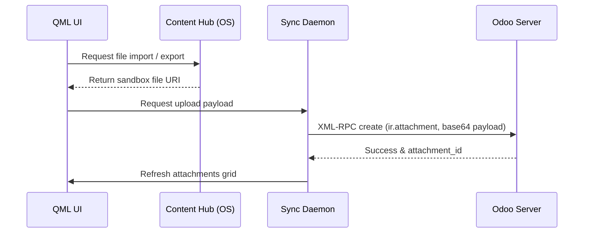

# UI/UX & navigatie Technische referentie

Op deze pagina worden het raamwerk van de gebruikersinterface, de navigatierouteringspatronen, de donker/licht-themawisseling en het Content Hub-bijlagebeheersysteem beschreven.

## Codebase-kaart

| Laag | Pad | Doel |
|---|---|---|
| **Wortelschelp** | `qml/TSApp.qml` | Applicatie-ingangspunt en lay-outshell |
| **Hamburgermenu**| `qml/components/NavigationMenu.qml` | Desktop/mobiele navigatielade |
| **Gedeelde lay-outs** | `qml/components/` | Aangepaste rasters, tekstwidgets en pictogrammen |
| **Bijlage-UI** | `qml/features/updates/Attachments.qml` | Bijlagenraster en browserschermen |
| **Helperhulpprogramma's** | `models/utils.js` | UI-formaten en themahelpers |

## Interfaceontwerp en navigatie-indeling

De applicatie maakt gebruik van QML (Qt Quick Controls 2 - Suru Theme layout) geoptimaliseerd voor convergente platforms:

### 1. Responsief ontwerp met meerdere panelen (convergentie)
* **Mobiele modus**: enkele actieve pagina. Veegbewegingen naar de linkerrand activeren een lademenu.
* **Desktop-/tabletmodus**: maakt gebruik van een indeling met gesplitst deelvenster. Het navigatiemenu is permanent aan de linkerkant vastgezet, terwijl submenu's en detailschermen naast elkaar worden geopend.

### 2. Navigatieroutering
Navigatie verwerkt de sequentiële hiërarchie (bijvoorbeeld Projecten -> Taken -> Urenstaten) met behulp van een centraal stapelmodel:
```qml
StackView {
    id: pageStack
    anchors.fill: parent
    initialItem: Qt.resolvedUrl("features/dashboard/Dashboard.qml")
}
```

---

## Content Hub-bevestigingssysteem

Ubuntu Touch maakt gebruik van het **Content Hub**-portalmechanisme om bestanden veilig over applicatiegrenzen heen te delen.

### Lokale schematoewijzingen

#### `ir_attachment_app`
Cachet metagegevens van bijlagen.
* `id` (INTEGER, primaire sleutel): Odoo-bijlage-ID.
* `name` (TEKST): Bestandsnaam.
* `datas` (TEXT): Base64-gecodeerde bestandsgegevens (indien lokaal opgeslagen).
* `res_model` (TEXT): Gekoppelde modelnaam (bijvoorbeeld `project.task`).
* `res_id` (INTEGER): Gekoppelde record-ID.

#### `attachment_download_app`
Houdt de downloadstatus van grote bijlagen bij.
* `attachment_id` (INTEGER): Verwijst naar de bijlagerecord.
* `local_path` (TEXT): Absoluut pad naar bestand op schijf.
* `status` (TEKST): Staat (`NOT_DOWNLOADED`, `DOWNLOADING`, `DOWNLOADED`).

### Synchronisatiestroom van bijlagen


