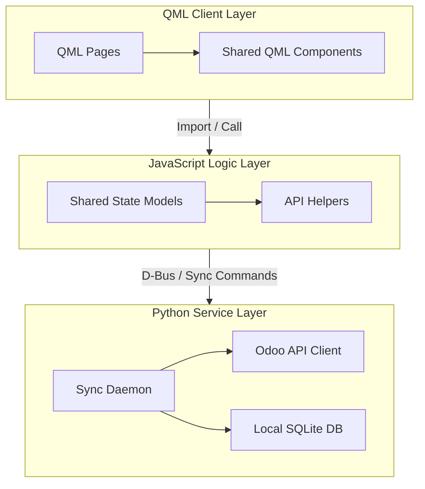

# Architectuuroverzicht

TimeManagement is een desktop- en Ubuntu Touch-applicatie die bestaat uit drie hoofdlagen:

- QML voor interface- en app-shellgedrag
- JavaScript-modules in `models/` voor gedeelde status en helpers aan de clientzijde
- Python-services in `src/` voor backend, synchronisatie, daemon, configuratie en hulpprogrammalogica

## Stroom op hoog niveau

Op hoog niveau:

1. QML-pagina's en componenten geven de productinterface weer.
2. Gedeelde JavaScript-modules ondersteunen status- en functielogica aan de clientzijde.
3. Python-modules verzorgen backend-bewerkingen, synchronisatieroutines en systeemgericht gedrag.

## Belangrijke technische mappen

- `qml/`: gebruikersinterface van de applicatie, gedeelde componenten, afbeeldingen en functiepagina's
- `models/`: JavaScript-modules geïmporteerd in QML
- `src/`: Python-backend en synchronisatielogica
- `assets/`: branding en artwork op pakketniveau
- `docs/`: brondocumentatie bewaard in de hoofdrepository
- `website/`: Docusaurus-gebaseerde website en documentatieportaal

## Systeemarchitectuurmodel

Hier is de weergave op hoog niveau van de drielaagse architectuur en componentintegratie van TimeManagement.

### Architectonisch diagram

## Documentatie bedoeling

Dit technische gedeelte zou het volgende moeten beantwoorden:

- waar code hoort
- hoe functies over de stapel worden verdeeld
- hoe het project wordt gebouwd en verpakt
- how contributors should reason about changes that span QML, JS, and Python
